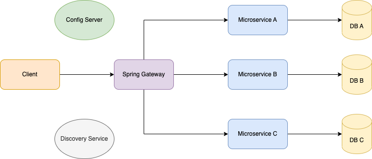

# Spring Cloud Security JWT
Spring Cloud Security JWT is Simple MicroServices project to demonstrate Spring Cloud Components and how it interacts with Config server, Discovery Server and how its performing security validation.

## Architecture


## Prerequisites
* Java 17

## Build all projects
```shell
./gradlew clean build
```

## Run Config Service
```shell
java -jar config-service/build/libs/config-service-0.0.1.jar
```

## Run Discovery Service
```shell
java -jar discovery-service/build/libs/discovery-service-0.0.1.jar
```

## Run Gateway Service
```shell
java -jar gateway-service/build/libs/gateway-service-0.0.1.jar
```

## Run Auth Service
```shell
java -jar auth-service/build/libs/auth-service-0.0.1.jar
```

## Run bike Service
```shell
java -jar bike-service/build/libs/bike-service-0.0.1.jar
```

## Testing Scenarios
### Execute auth register REST call
```shell
curl --location --request POST 'http://localhost:8080/auth/register' \
--header 'Content-Type: application/json' \
--data-raw '{
    "email": "sk@gmail.com",
    "password": "password",
    "name": "name"
}'
```

```shell
{
    "accessToken": "<TOKEN>",
    "refreshToken": "<TOKEN>"
}
```

### Execute Get Cars REST call without Authorization header
```shell
curl --location --request GET 'http://localhost:8080/bike'
```

```shell
401 
```

### Execute Get Card REST call with Authorization header from step 1
```shell
curl --location --request GET 'http://localhost:8080/bike' \
--header 'Authorization: <TOKEN>'
```

```shell
[
    {
        "bikeId": "1",
        "bikeName": "RTR 160"
    }
]
```

